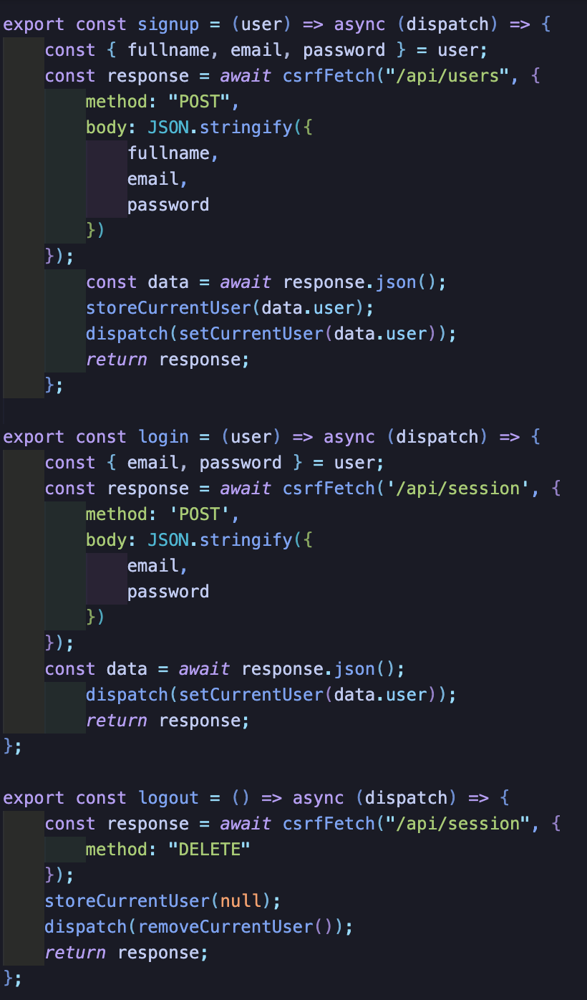
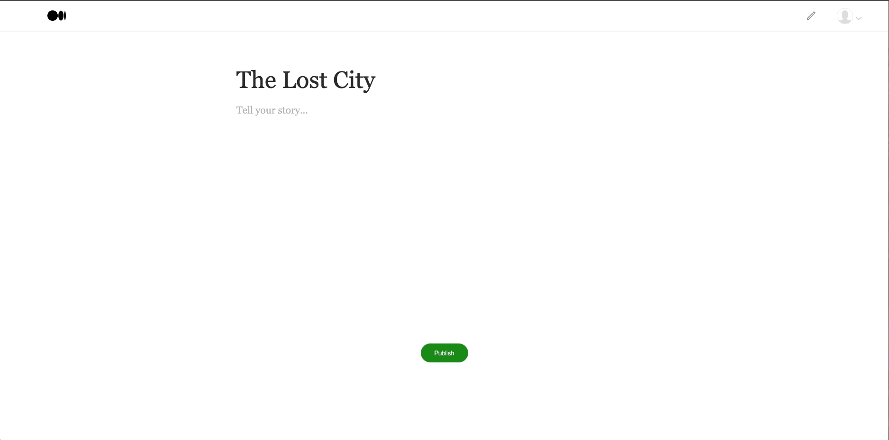
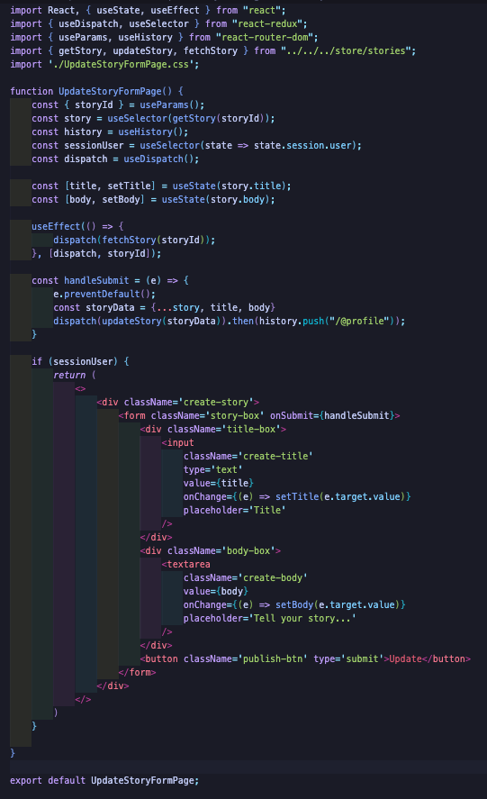
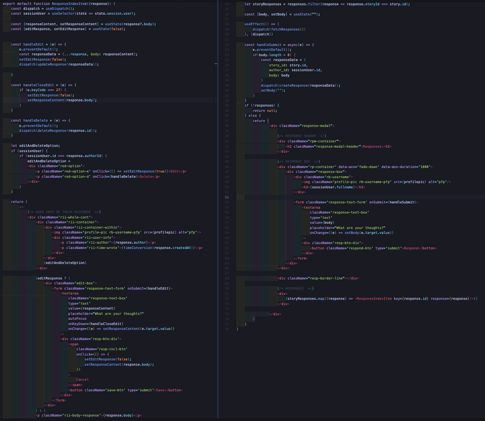
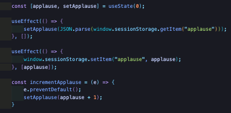

# Readium

[Readium live site!](https://readium.onrender.com/)

## Background 

A fullstack clone of the publication site Medium where you have full control of what you stories you want to post for others to see. Users are able to read the top trending stories on Readium, as well as edit and update stories of their own. 

## Technologies Used 

* React 
* Redux 
* Ruby on Rails 
* BCrypt 
* PostgreSQL 

## Features 
### User Authentication - Login/Signup 

### Creating and Updating a Story
 

## Responding to a story

## Applauding a story 

## Future Features 
* Editing User information - Users will be able to change their profile names!

